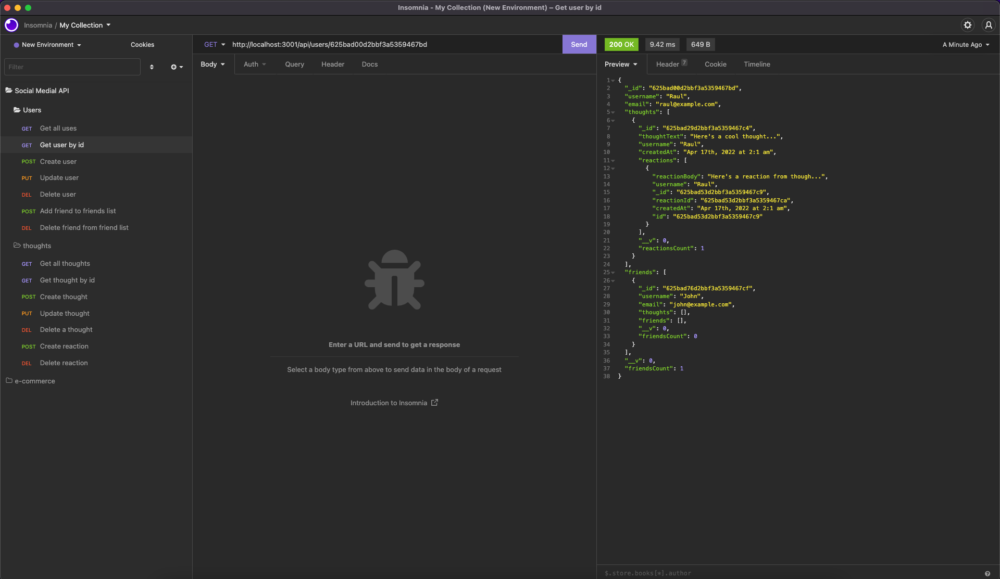

# Social Network RESTful API


## Description

This is a social network RESTful API. This API allows you to create, read, update, and delete users, thoughts, and reactions. Also, you can add users to your friends list and remove them.

## Table of Contents

- [Social Network RESTful API](#social-network-restful-api)
  - [Description](#description)
  - [Table of Contents](#table-of-contents)
  - [Technologies Used](#technologies-used)
  - [Walkthrough](#walkthrough)
  - [Screenshots](#screenshots)
  - [Installation](#installation)
  - [Start Server](#start-server)
  - [License](#license)
  - [Contributing](#contributing)
  - [Questions](#questions)

## Technologies Used

- [Node.js](https://nodejs.org/)
- [Express](https://expressjs.com/)
- [MongoDB](https://www.mongodb.com/)
- [Mongoose](https://mongoosejs.com/)

## Walkthrough
[Walkthrough Link](https://www.youtube.com/watch?v=gZWpTpqZnzU)

## Screenshots



## Installation

```
git clone git@github.com:jimenezraul/SN-API.git
cd SN-API
npm install
```

## Start Server

```
npm start
```

## License

[](https://opensource.org/licenses/MIT)

## Contributing

- Raul [GitHub](https://github.com/jimenezraul)

## Questions

Contact me by email
Email: [jimenezraul1981@gmail.com](mailto:jimenezraul1981@gmail.com)
